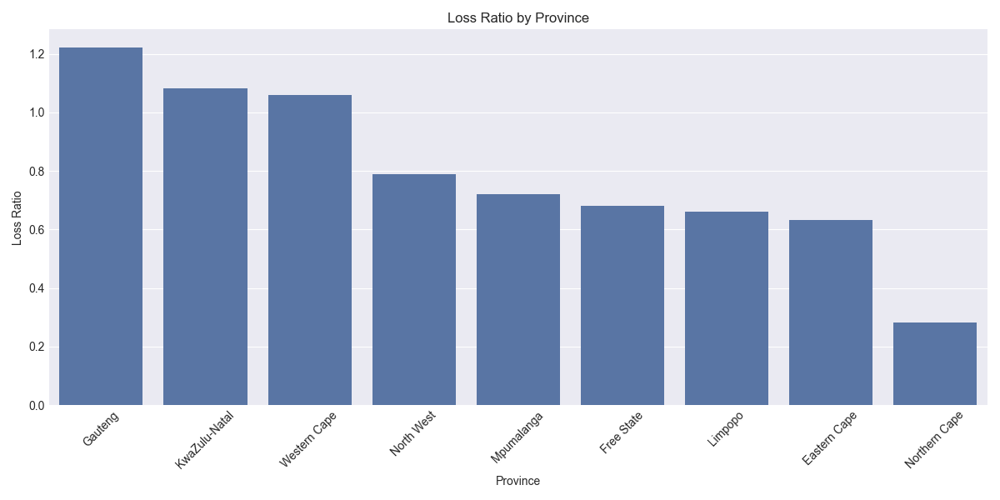
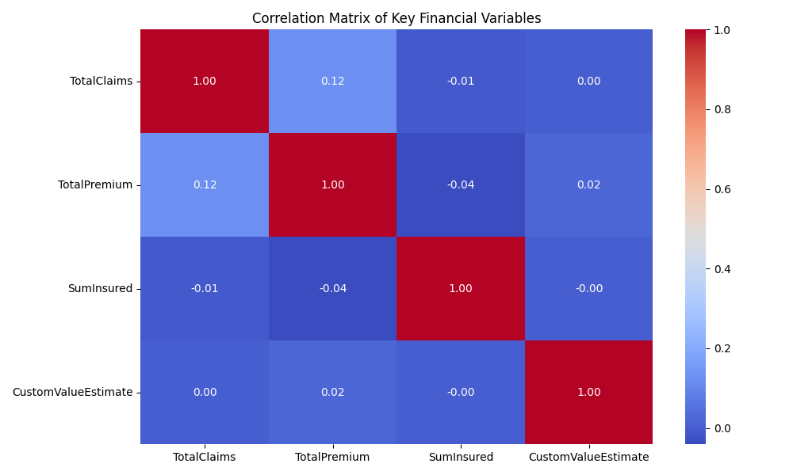
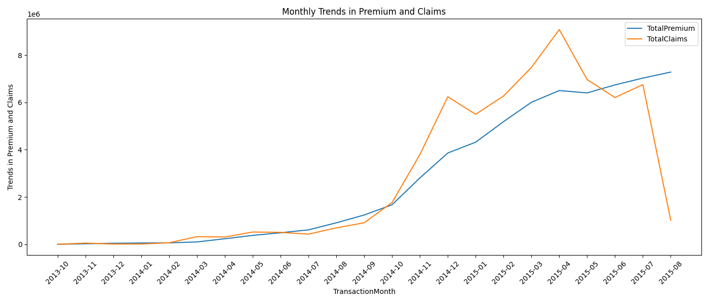
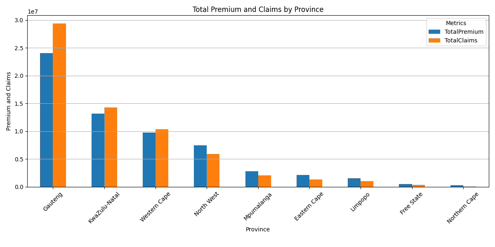
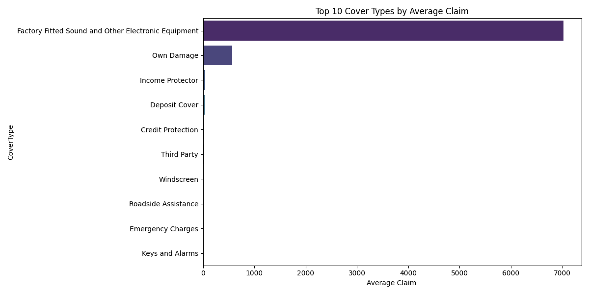
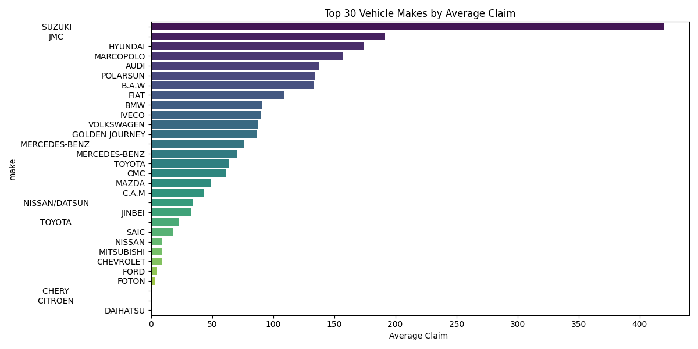

# End-to-End Insurance Risk Analytics & Predictive Modeling | ML Project

### 📘 Project Overview

This project focuses on analyzing and modeling insurance policy and claim data for risk evaluation and premium optimization. The dataset comprises over 1 million rows from an insurance portfolio with features including vehicle characteristics, policy details, and financials (claims, premiums). The goal is to explore risk drivers and build predictive models for smarter pricing and segmentation.
- Generally, This project investigates patterns of risk and profitability in a large insurance dataset. We aim to understand customer segments, risk factors, and develop data-driven pricing strategies using EDA, hypothesis testing, and predictive modeling.
---
## 🏗️1. Project Setup and EDA
* Branch created: `task1` exclusively for task one.
#### Repo/Project Structure
```bash
insurance-analytics-kaim-week3/
    ├── src/
    ├── figures/
    ├── scripts/
    ├── notebooks/
    ├── data/
    │   ├── raw/
    │   └── processed/
    ├── tests/
    ├── .github/workflows/
    ├── config/
    ├── README
    ├── requirements.txt
    ├── .gitignore
```
#### Tech Stack - Tools Used
- Python 3.11+
- Pandas, NumPy, Seaborn, Matplotlib
- Scikit-learn, XGBoost, LIME
- DVC (for data versioning)
- PyTest (for testing)
- GitHub Actions (CI/CD)

### ✅ GitHub Setup
- Created a structured GitHub repository with modular code organization.
- Set up CI/CD using GitHub Actions.
- Installed all project dependencies and documented them in `requirements.txt`.

### ✅ Exploratory Data Analysis (EDA)

The dataset contains 1,000,098 rows and 52 columns. The main steps completed include:

### 🔹 Data Structure Review
- 15 numerical columns (e.g., `TotalPremium`, `TotalClaims`, `CustomValueEstimate`) - 11 floats and 4 integers.
- 36 categorical columns (e.g., `Province`, `VehicleType`, `Gender`)
- 1 boolean column

### 🔹 Missing Data
Heere are missed number of rows for each columns:
| Column                  | Missing Rows | % Missing |
| ----------------------- | ------------ | --------- |
| NumberOfVehiclesInFleet | 1,000,098    | 100%      |
| CustomValueEstimate     | 779,642      | 77.9%     |
| CrossBorder             | 999,400      | \~99.9%   |
| Gender                  | 9,536        | 0.95%     |
| MaritalStatus           | 8,259        | 0.83%     |

  Note: Columns with larger nulls are reviewed for relevance.
- Significant nulls found in:
  - `NumberOfVehiclesInFleet` (100%)
  - `CustomValueEstimate` (77%)
  - Vehicle metadata (`make`, `Model`, `bodytype`, etc.) — ~552 rows missing

#### 📊 Descriptive Statistics
- Generated summary statistics for numerical columns.
- Reviewed data types for formatting and conversion.
- Created histograms and bar plots for key financial and categorical variables.
- Assessed missing values and outliers in columns like `TotalClaims`, `CustomValueEstimate`, and `TotalPremium`.

#### 📈 Visual EDA
- Histograms for numerical distributions (e.g., `TotalPremium`, `TotalClaims`).
- Bar plots for key categoricals (e.g., `Province`, `Gender`, `CoverType`).
- Box plots for identifying outliers in premium and claims.

#### 🔁 Loss Ratio Analysis
- Computed overall loss ratio = `TotalClaims / TotalPremium`.
- Grouped and compared by Province, Gender, and VehicleType.
- Insight: Loss ratio significantly varies across locations and demographics. e.g Loss Ratio by Province


#### 📉 Multivariate Analysis and 🗺️ Geographic Comparison
- Correlation matrix between numerical features (e.g., `TotalClaims`, `TotalPremium`, `SumInsured` etc).

  - The correlation matrix revealed strong associations between TotalPremium and SumInsured, with weak-to-moderate correlations with TotalClaims.
- Explored trends of claims vs. premiums by PostalCode.
- Visualized monthly trends using `TransactionMonth`.

  - Monthly line plots showed seasonal patterns, including peaks and troughs in both premiums and claims. Actually, the premium ammounts are increasing, and the claim decreasing eventhough it was high on 2014-10 to 2015-04.

- Analyzed trends across provinces and postal codes.

  - Bar plots of premium and claims across provinces uncovered regional imbalances, particularly in Gauteng, indicates larger loss since higer claims thatn premium. However in Mpumanlanga and Limpopo there is profit.
- Compared premiums and claims across CoverType and Vehicle make.

  - Factory filtered sound and Other elctronic equipment cover type claims the most among all.

   - Vehicle make analysis highlighted brands associated with higher average claims, useful for underwriting adjustments. the highest claim is found by SUZUKI

##### 🔍 Summary on Visualizations
- **Histograms** for numerical features like `TotalPremium`, `TotalClaims`, and `CustomValueEstimate` to examine distribution shapes and potential skewness.
- **Bar plots** for categorical features such as `Gender`, `Province`, and `VehicleType` to explore frequency distributions.
- **Box plots** for identifying outliers in financial variables in claim severity and frequency.
- **Loss Ratio Analysis**: Visualized loss ratios (`TotalClaims` / `TotalPremium`) grouped by `Province` to identify risk-heavy regions.
  - etc

📂 Output: All plots are saved in the `figures/` directory.

---
## ✅2. Data Versioning with DVC
To establish a **reproducible and auditable data pipeline** using **Data Version Control (DVC)**, enabling us to version large data files independent of Git and maintain compliance with industry standards.

**📁 Project Setup:**

* Branch created: `task2`
* Merged all changes from `task1` for continuity.


 **DVC Initialized**:
* `dvc init` created the `.dvc/` directory and tracking config files.
* DVC was initialized in the project using `dvc init`.
* `.dvc/` directory and `.dvcignore` file generated and committed.
  * make sure dvc is already installed using `pip install dvc`

**🗃️ Remote Storage:**

* Local remote storage created by:

  ```bash
  mkdir ../dvc-storage
  ```
* Once `../dvc-storage` created and add it as the default remote via:

  ```bash
  dvc remote add -d localstorage ../dvc-storage
  ```

* The large file `MachineLearningRating_v3.txt` was excluded from Git in `.gitignore`, but tracked using DVC:

  ```bash
  dvc add data/raw/MachineLearningRating_v3.txt
  ```

* This generated `MachineLearningRating_v3.txt.dvc`, which is committed to Git as:
  ```bash
  git add data/raw/MachineLearningRating_v3.txt.dvc
  git commit -m "Track raw dataset with DVC"
  ```
**Versioning Achieved**:

  * Dataset is now versioned separately from the codebase.
  * Enables full reproducibility for future model audits and updates.

  * *DVC metadata file size: 529MB tracked via MD5 hash `f6b7009b68ae21372b7deca9307fbb23`*

  * *Data stored locally in `../dvc-storage`.*

**Finally🚀, Data Push:**

* Data successfully pushed to local DVC remote via:

  ```bash
  dvc push
  ```
**📦(Usage) Reproducibility with DVC**
* To download the dataset from the local DVC remote (e.g., if you've cloned the repo):

  ```bash
  dvc pull
  ```
---

## 🧪 3. Hypothesis Testing – Risk Driver Analysis

To statistically validate or reject assumptions about **key risk drivers**, we conducted a series of **A/B hypothesis tests** focusing on *claim frequency*, *claim severity*, and *profit margin*. This lays the foundation for our segmentation strategy.

**🧮 Metrics Used**

* **Claim Frequency**: Proportion of policies with at least one claim.
* **Claim Severity**: Average claim amount (for policies that claimed).
* **Margin**: TotalPremium − TotalClaims.

**📊 Statistical Tests Applied**

* **Chi-Squared Tests** for categorical comparisons (e.g., claim rates by province or gender).
* **T-Tests** for numerical comparisons (e.g., severity and margin between groups).
* **FDR Correction** applied for multiple hypothesis tests.

**✅ Hypotheses Evaluated**

| Hypothesis                                                                 | Metric                      | Result                 |
| -------------------------------------------------------------------------- | --------------------------- | ---------------------- |
| H₀: No risk differences across **provinces** (Gauteng vs. KwaZulu-Natal)   | Frequency & Severity        | ❌ Rejected             |
| H₀: No risk/margin differences across **postal zones** (High vs. Low Risk) | Frequency, Severity, Margin | ✅ Partially Rejected   |
| H₀: No **margin** difference between **zones**                             | Margin                      | ❌ Rejected             |
| H₀: No risk difference between **genders** (Female vs. Male)               | Frequency & Severity        | ❌ Rejected (Freq only) |

**📈 Plots**

Two key insights were visualized:

* `Claim Frequency by Province`: highlights regional variation in risk.
* `Margin by Gender`: shows profitability differences.
**🧠 Key Insights**

* Gauteng had significantly higher claim frequency and severity — may justify premium uplift.
* High-risk postcodes correlated with poor margins — opportunity for rate adjustment.
* Female policies showed higher frequency but similar severity — data imbalance noted.

---

## 📌 Next Steps
- Build predictive models for premium optimization and claim forecasting (Task 4).

